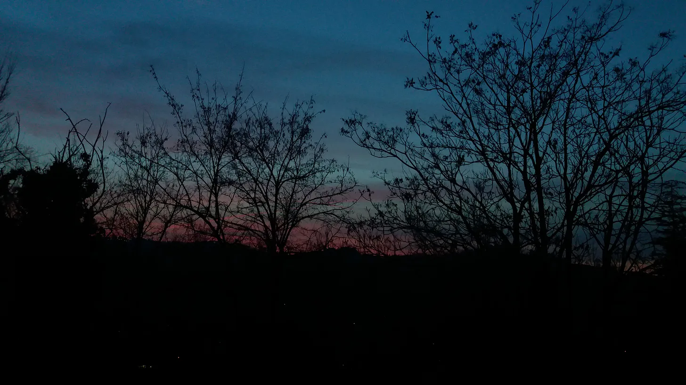

Il viaggio mattutino verso l'ufficio offre sempre degli spunti di riflessione. Sarà che sono le otto di mattina e non mi basta mai una tazzina di caffè per diventare un adulto; sarà che il viaggio dura un'ora e verso metà finisco la dose di notizie giornaliere che mi interessano.

Sarà che viaggiare nel flusso di macchine, di gente che si mette sulla strada alle otto di mattina, ed essere così bene incastrato tra la macchina davanti e il camion dietro, tra tutti i rumori che confluiscono nella sinfonia urbana tangente al mio terzo risveglio mentre spio i volti dietro lo specchio, mi ricordano che pure ieri l'ho fatta quella strada. E domani la farò.

E immediatamente mi sale questa voglia di tradurre tutta la quotidianità in un rito religioso. Di calcolare ogni mia minima abitudine, per vestirla di gloria e grandi intenzioni, gesta e sforzi che ammiccano all'eroico e all'epica (che proprio ieri leggevo che era da matti leggerla e ancora più da matti era crearla di nostra mano).

Mi sento spesso, in quei viaggi di mattina, un eroe epico. Non romantico. Romantico sarebbe uno che si incammina idealizzando la metà come il momento di gratificazione massima dal travaglio di essersi messo in cammino. Ma proprio perchè è alla ricerca della gratificazione della fine del viaggio, il suo viaggio non finisce mai. Semplicemente ne inizia di nuovi. Entra in ogni casa che può, ma rimane deluso e se ne esce lasciando la porta aperta. Un eterno clandestino nelle mani dei cartelli stradali che lo puntano non verso la meta, ma più lontano possibile da dove ha iniziato.

Un eroe epico, invece, si ritrova con i piedi sulla strada e non può fare altro che percorrerla tanto a lungo, quanto a lungo la luce lo condurrà dentro di sè. E non è UNA meta che insegue, ma è la consapevolezza di avere viaggiato ed essersi addormentato alla penombra di ogni nuovo orizzonte.

---

Sembrerebbe una contraddizione descrivere un viaggio che si ripete ogni 8.00 e 12.00 di mattina come un viaggio epico, ma è proprio lì il posto dove dobbiamo cercarla l'epica.

>Negli **strappi di realtà** che lasciano intravedere un mondo di simboli al di sotto di tutta la normalità boriosa di questi tempi. 

>Nei **panni stesi al sole** (quando c'è) o nei nostri 'oh cazzo' quando ci dimentichiamo di raccoglierli. 

>Nei **colori delle case**, che sembrano scelti a caso dalle coppie che ci vivono, ma in verità sono orchestrati da una sorta di coscienza condivisa (simile a quella di Jung, più o meno) e quindi dall'umanità intera.

>Nelle **storie popolari** che ti scivolano addosso tutta la vita, ma poi arriva il giorno che scambi due parole con il matto del villaggio e ti sembra di vivere in una fiaba e un po' lo invidi.

>Nel **continuo sforzo umano di incontrarsi**, rifiutando che tempismo e distanza siano forze più ponderanti dell'amore e dell'amicizia.

>Nelle **cene tra amici**, conoscenti, pranzi condivisi coi colleghi, aperitivi di gruppo con sconosciuti annessi che alla fine ti salutano abbracciandoti.

Insomma **l'epica delle storie piccole e appese al sole** (sì, come i panni sporchi che ci siamo dimenticati qualche passo prima), apparentemente usate, trite e ritrite, ripetitive, ma nella verità mai uguali.

--- 

E cosa c'è di più epico di una storia unica, inimmaginabile e nuova ogni volta che nasce un nuovo essere umano sulla terra, espressa in tutti questi rituali condivisi che spostano avanti il piede destro e il piede sinistro di tutti noi, alla ricerca di **nuovi orizzonti** sotto cui addormentarsi?

